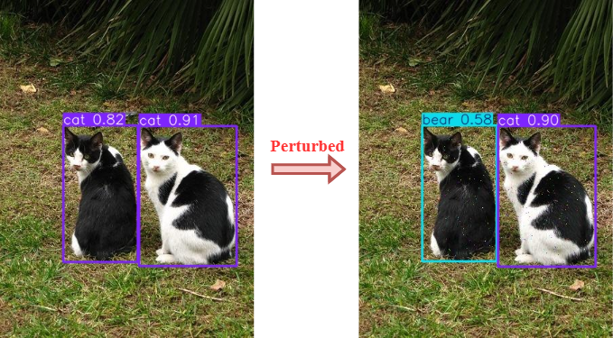

# Gradient-Free Sparse Adversarial Attack on Object Detection Models
This repository contains the official code of our paper, *"Gradient-Free Sparse Adversarial Attack on Object Detection Models"* accepted at GECCO 2025.



## Setup
1. Download the PASCAL VOC 2007 Dataset from [here](https://www.kaggle.com/datasets/zaraks/pascal-voc-2007/data),

    or download the subset of PASCAL VOC 2007 used in our experiments from [here](https://www.kaggle.com/datasets/cuonglch/pascalvoc-testset-ver1/data).

    The dataset should be organized in this structure (optional):    
    ```LFW dataset/  
    │── Annotations/  
    │   ├── <img_name1>.xml  
    │   ├── <img_name2>.xml  
    │   ├── ...  
    │  
    │── Images/  
    │   ├── <img_name1>.jpg  
    │   ├── <img_name1>.jpg  
    │   ├── ...  

2. Clone the Repository, Navigate to the Source Directory and Install the requirement packages.

    ```cmd
    $ git clone https://github.com/LCCuong/Gradient-Free-Sparse-Adversarial-Attack-on-Object-Detection-Models
    $ cd Gradient-Free-Sparse-Adversarial-Attack-on-Object-Detection-Models
    $ pip install -r requirements.txt
    ``` 

## Reproducing the results
- You can reproduce the results in our paper for YOLO models by runing the following scripts:

    1. `GA (T = 2)`: not using archive, tournament size `T = 2`.
        ```cmd
        $ python main.py --model_name <MODEL_NAME (e.g., YOLOv8)> --img_path <PATH_TO_Images> --tournament_size 2 --elite_prob 0.0
        ```
    2. `GA (T = 4)`: not using archive, tournament size `T = 4`.
        ```cmd
        $ python main.py --model_name <MODEL_NAME> --img_path <PATH_TO_Images> --tournament_size 4 --elite_prob 0.0
        ```

    3. `GAA (T = 2)`: using archive, tournament size `T = 2`.
        ```cmd
        $ python main.py --model_name <MODEL_NAME> --img_path <PATH_TO_Images> --tournament_size 2
        ```
    4. `GAA (T = 4)`: using archive, tournament size `T = 4`.
        ```cmd
        $ python main.py --model_name <MODEL_NAME> --img_path <PATH_TO_Images> --tournament_size 4
        ```

- More details of parameters can be found in [`main.py`](https://github.com/LCCuong/Gradient-Free-Sparse-Adversarial-Attack-on-Object-Detection-Models/blob/master/main.py#L25).


<!-- # Visualization -->
<!-- Source code for results visualization can be found here [script/] -->
## Demo
For demo, you can run the following script:
```cmd
    $ streamlit run demo.py
```


## Citation

If you use our source code, please cite our work as:

```bibtex
@inproceedings{CuongTriGecco2025,
  author       = {Chi Cuong Le, Tri Phan, Ngoc Hoang Luong},
  title        = {{Gradient-Free Sparse Adversarial Attack on Object Detection Models}},
  booktitle    = {GECCO '25: Proceedings of the Genetic and Evolutionary Computation Conference},
  address      = {Málaga, Spain},
  publisher    = {{ACM}},
  year         = {2025}
}
```